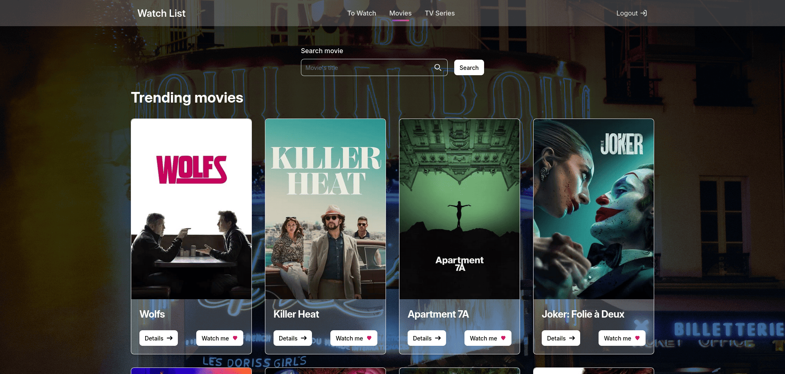

# Watch List



Watch List is an app that lets you save and organize movies or series you plan to watch later.

## Demo Live

Try the live demo [here.](https://gitmbints.github.io/watch-list/login)

Account to test:

- **Username** : papspaps
- **Password**: paps123!

## Usage

1. Log in with your TMDB account credentials.
2. Use the app with the features listed below.

## Features

- **Search** : Quickly find a movie or series via the search bar.
- **Media details** : View synopsis, episodes, and other information.
- **Save media:** : Add items to your personal watch list.
- **Remove media** : Remove an item from the list once you've watched it.

## Technologies

- **Angular** : Main framework.
- **TypeScript** : Development language.
- **HTML & CSS** : Structure and styling.
- **Git** : Control verion.
- **GitHub Page** : Hosting.
- **TMDB** : For media data

## Installation

1. Clone the repository: :
   ```bash
   git clone https://github.com/votre-utilisateur/watch-list.git
   ```
2. Navigate to the project folder: :
   ```bash
   cd watch-list
   ```
3. Install dependencies :
   ```bash
   npm install
   ```
4. Start the app :
   ```bash
   npm start
   ```
5. Open `http://localhost:4200` in your browser.

## Contributing

Contributions are welcome :

1. Fork the repository.
2. Create a branch (`git checkout -b feature/my-feature`).
3. Commit your changes (`git commit -m 'feat: my new feature'`).
4. Push the branch (`git push origin feature/my-feature`).
5. Open a Pull Request.

## Thank you for checking out this project!
